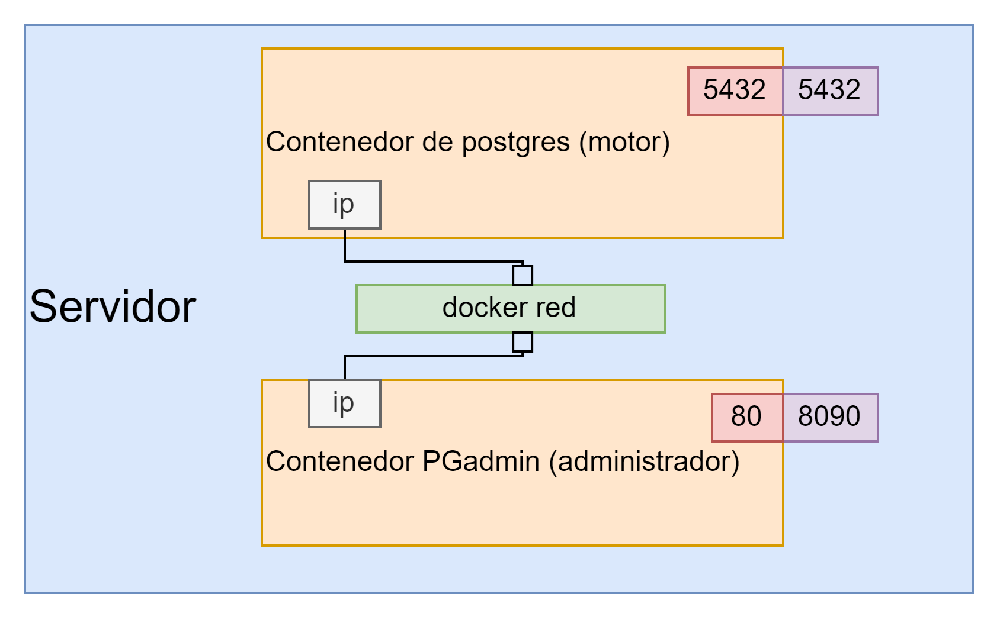

# Puertos y red en contenedores



### comandos:

- docker run: descarga y ejecuta un contenedor
- -d: Permite correr en segundo plano
- - - name: Agrega el nombre del contenedor
- -p: Especifica que el puerto del anfitrión y el puerto del contenedor

# Postgresql

```bash
# docker run: Correo la imagen de postgres (desde dockerhub.com)
# -d: Correo en segundo plano. 
# --name: Nombre del contenedor de postgres
# -e: variable de entorno para el usuario Postgres
# -p: puerto del anfitrion y del contenedor
# postgres: nombre de la imagen tal cual aparece en el buscardor de dockerhub
docker run -d --name dbpsql -e POSTGRES_PASSWORD=admin  -p 5432:5432 postgres
```

# PGadmin

```bash
docker run -d --name pgadmin -p 8090:80 -e PGADMIN_DEFAULT_EMAIL=maguaman2@sudamericano.edu.ec -e PGADMIN_DEFAULT_PASSWORD=admin dpage/pgadmin4
```

Probar abriendo localhost:8090

# Crear red

redsuda es un nombre que puede cambiar

```bash
docker network create --attachable redsuda
```

## Agregar contendedor a red

```bash
#Agregar contenedor de postgresql
docker network connect redsuda dbpsql

#Agregar contenedor de pagadmin
docker network connect redsuda pgadmin

#verificar contenedores conectados a la red. Este comando muestras las IPs
# asignadas a cada contenedor
docker inspect redsuda
```